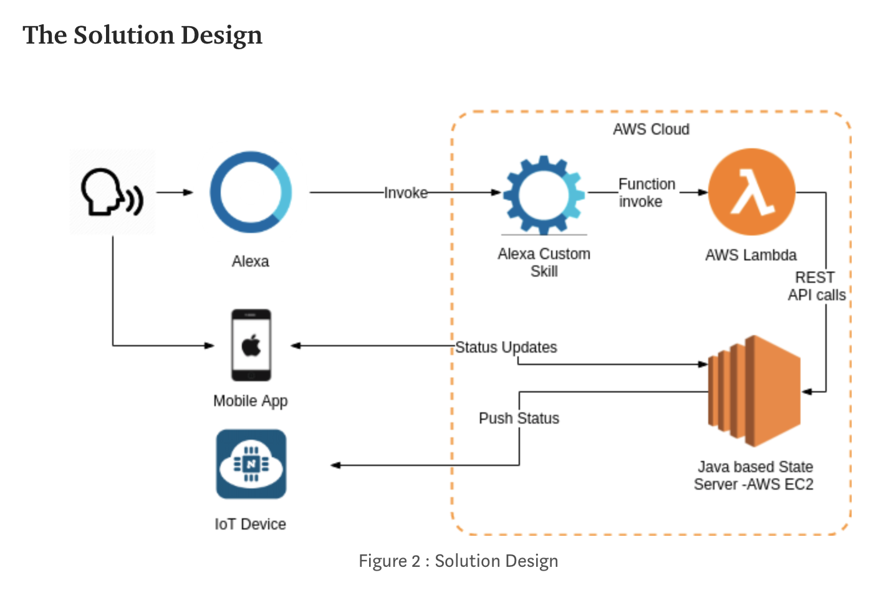

# MadLibsAlexaSkill

## Overview
This custom Alexa skill plays Mad Libs with users. To clarify, Mad Libs is a game traditionally played with a printed workbook that asks the user for certain parts of speech. The user takes the words they just thought of and plugs them into a story, often resulting in a silly, nonsensical narrative. To convert this traditional game into an Alexa skill, Alexa will ask the user for all the required words and then read the story back to the user. For example, the user would say “Alexa, play Mad Libs” and Alexa would respond with an opening message and “Name a plural noun.” Alexa would continue to ask the users for other types of words and finally read the complete story back to the user.

## Requirements

### Use Cases
1. As an owner of an Alexa and a parent, I want a fun game for my children that is both educational and fun because many games are not educationally stimulating.
2. As an owner of an Alexa and an elementary school teacher, I want a fun game for my students that will teach them new vocabulary and grammar skills because many traditional methods for teaching these subjects are boring to the students. 
3. As a parent, I want an interactive game for my children that is creative because many video games stunt creativity.
4. As a parent, I want a game for my children that does not involve any screen time because they stare at screens too long and I allow them limited time on screen devices.
5. As a child, I want a fun game that I can play alone or with friends because sometimes I have to entertain myself and sometimes I have friends or siblings to play with.
6. As a child, I want to play MadLibs about my favorite topics because I'm really interested in some things like sports, but wouldn't want to do a Mad Lib about bugs.

### List of Requirements
* Shall play the traditional Mad Libs game with users.
* Shall ask the user for specific types of words such as cities, states, foods, etc.
* Shall read the complete story back to the user.
* Shall pull from a bank of stored Mad Libs.
* Should prompt users for the type of word again if their previous answer is invalid for the requested type.
* Should allow, but not require, the user to choose a certain topic for their Mad Lib.
* Should repeat the complete story if the user asks for it to be repeated immediately after it is read.

## Development Approach
In order to understand how to develop an Alexa skill, we looked through Amazon Alexa documentation. We created a custom skill from a quick start template. The general pattern of a custom skill utilizes "intents" the user gives in their input to call the coordinating event handler. This event handler then processes the user input and returns the desired output to Alexa who then responds to the user.

To represent the Mad Libs themselves, we will create a MadLib class that contains the story as a string, a stack of types of input words, and related topics. Then, instances of the MadLibs class will be stored as constants.

### Infrastructure 

source: https://medium.com/coinmonks/alexa-custom-skill-with-aws-lambda-to-control-iot-device-68f37beac3fb 

### Implementation
We will utilize an Agile approach to developing this Alexa skill, implementing very few feautures in each sprint. After each sprint, we will have a new icremental working version of the application that is able to be tested. This incremental testing ensures that the current version of the application is never far from the last working version. The waterfall approach takes the risk of developing all the features at once, the application not functioning correctly, and the developers having little idea where the errors are occuring. With this Agile implementation, if an error occurs, it must be in the most recent feature/sprint as the last sprint produced a functional application. Our coding standards will uphold that of the Java language and our relevant computer science coursework. 

### Testing
We will test our Alexa skill both internally and with external users. First, we will conduct internal tests to ensure base functionality. These tests will be completed incrementally after each sprint. Aditionally, after every few sprints we will conduct user testing to get feedback on how users interact with the Alexa skill. During testing, users will provide feedback on the ease of use, intuitiveness, enjoyment, etc. of our Mad Libs Alexa skill. 

### Maintenance and Sustainability
The maintenance of this application would involve further cycles of development. The usage of this application will be monitored to find additional features, bugs, or opportunities for general improvement. This process would include interviewing current users and acting as a test user ourselves. When additional feature or fixes to the application become apparent, this development cycle will start again from step 1, gathering requirement, and continue through design, implementation, and testing.
